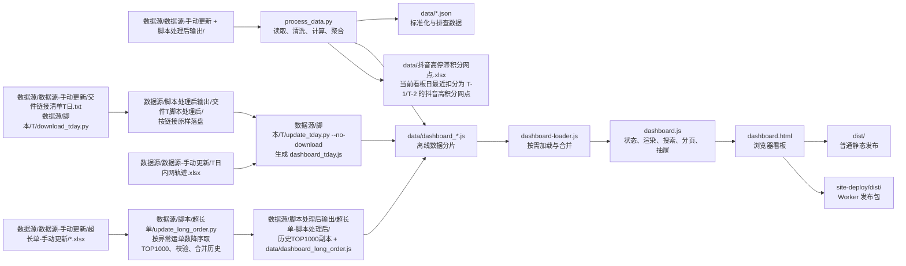

# 交件监控中心项目交接文档

> 交接日期：2026-09-23
> 代码基线：`b3e2676`（2026-09-23；本次超长单省区、序号、检索及分片 schema 3 改动尚未提交）
> 数据基线：交件/积分截至 2026-09-22，管控截至 2026-09-23；超长单截至 2026-09-22
> 最后脚本核验：2026-09-23（常规数据、超长单 schema 3 分片、自动化测试及静态语法核验；超长单已做 `file://` Edge 桌面、1120px、760px、440px 及搜索/筛选/抽屉回归；T日看板仍未做完整人工页面校验）
> 文档角色：项目当前事实、已确认业务口径与 AI 协作规则的主交接文档
> 适用对象：AI 协作者、业务运营、数据维护人员、前端维护人员、发布人员

## 0. AI 冷启动与上下文规则

本项目的新 AI 会话必须先完整读取根目录的 [AI 协作入口](AGENTS.md) 和本文档，再开始检查或修改项目。历史聊天只作为背景，不是默认开发依据。

### 0.1 每次新会话的启动顺序

1. 完整读取 `AGENTS.md` 与本文档。
2. 执行 `git status --short` 和 `git rev-parse --short HEAD`，确认是否存在未提交改动，以及当前提交是否仍与文档基线一致。
3. 如果是数据或业务任务，再读取 `data/data_quality_report.json`，确认实际数据日期和行数。
4. 根据本文档第 13 章定位相关源码，只读取与当前任务有关的文件。
5. 先区分“本文档记录的预期规则”和“代码体现的实际行为”，再实施最小改动。

### 0.2 信息权威顺序

1. 用户在当前任务中的最新明确要求。
2. 本文档中标记为“已确认”或“必须保持”的当前规则。
3. 当前代码、生成数据和页面体现的实际行为。
4. `README.md`。
5. 历史聊天、旧截图和未写入本文档的记忆。

最新用户要求可以改变现有规则，但改变完成后必须同步更新本文档。若文档与代码冲突，不可静默选择其一：代码说明现状，文档说明意图；应先核对 Git 差异，仍涉及业务取舍时再请求用户确认。

### 0.3 上下文重置原则

- 后续任务以本文档的最新版为项目上下文入口，不重新依赖已膨胀的历史对话。
- 不把聊天全文、试错过程或已经失效的要求复制进本文档。
- 本文档只保留当前有效行为、必要决策原因、待确认事项和可执行验收方式。
- 新 AI 不得根据“通常应该怎样”推翻已固化的项目行为或视觉样式。

### 0.4 文档时效检查

- 如果当前 HEAD 与顶部“代码基线”不同，先检查基线之后的相关提交或未提交差异，不能假定本文档仍覆盖所有变化。
- 如果 `data_quality_report.json` 的日期晚于顶部“数据基线”，以实际数据文件为运行现状，并在完成数据更新任务后刷新第 2 章。
- 如果仅文档发生变化而代码尚未提交，代码基线可以暂时保持最近业务提交，但交付时应明确文档仍未提交。
- 发现文档已过期时，应更新现有结论，不在末尾追加互相矛盾的新说明。

## 1. 项目概览

本项目是“揽交监控一体化”离线静态看板，汇总抖音、淘宝、京东、快手四个平台的交件超时、历史上榜、平台积分、平台管控及派送积分数据；另提供仅在主动选择当天日期时加载的抖音/淘宝 T 日临时监控。

项目主体没有数据库、业务接口或常驻后端服务。Excel 由 Python 统一清洗和聚合，浏览器通过本地 JavaScript 数据分片渲染页面；因此既可直接双击运行，也可构建为普通静态站点或单文件 Worker 发布包。

### 1.1 核心能力

- 四个平台的交件预警、平台切换、日期切换、网点搜索和客户趋势。
- 抖音高停滞积分网点、平台管控记录、极差熔断记录。
- 京东 TOP60、可调阈值、上榜次数及管控统计。
- 抖音派送积分与派送管控监控。
- 网点详情抽屉、客户趋势、积分趋势、历史缺货和清退信息。
- T 日临时监控：抖音/淘宝仅在主动选择本机当天日期后加载，首页展示内网轨迹按网点（有客户补充时按客户）聚合的 TOP10；24H/36H 量值可打开独立趋势抽屉。数据源缺失或跨日时明确显示“数据源未上传”，不沿用前一天快照。待发运时长按当前快照时间减第一条揽收时间，已发运时长按第一条分拨扫描时间减第一条揽收时间；最新状态为“始发退回”时另按第一条异常记录时间减第一条揽收时间，称重不作为实际交件时间。
- 离线数据分片加载，不依赖 CDN，不主动上传业务数据。

### 1.2 数据流



## 2. 当前交接基线

> 状态：[数据快照] 本章记录交接时点的代码和数据，不是永久业务规则；重跑数据或切换提交后应重新核对。

| 项目 | 当前值 |
|---|---|
| Git 分支 | `main` |
| 当前工作树 | 超长单省区、序号、检索、schema 3 分片、测试与文档改动尚未提交；T日看板仍未做人工页面校验 |
| 最近业务提交 | `b3e2676`，2026-09-23，9月22日 |
| 交件统计日 `as_of` | 2026-09-22 |
| 积分更新日 | 2026-09-22 |
| 管控快照日 | 2026-09-23 |
| 最近生成时间 | 2026-09-23 12:26:27 |
| 积分窗口起始日 | 2026-09-07 |
| 管控窗口起始日 | 2026-09-17 |
| 交件读取起始日 | 2026-07-01 |
| 支持平台 | 抖音、淘宝、京东、快手 |
| Python 依赖 | `openpyxl>=3.1,<4` |
| 前端技术 | 原生 HTML、CSS、JavaScript、Canvas |
| 超长单分片 | 2026-09-23 生成；schema 3；53 个日期文件、每个按异常运单数降序取 TOP1000、53,000 条网点日记录；最新源日 2026-09-22；业务省区来自③映射 |
| 高停滞积分 Excel | 仅含 2026-09-22 看板日最近扣分为 T-1/T-2 的 22 个网点，其中 T-1 13 行、T-2 9 行；位于 `data/抖音高停滞积分网点.xlsx` |
| 自动化测试 | 高停滞积分 Excel、归因边界及超长单分片测试 7 项 |
| 独立后端 | 无 |

当前 `data/data_quality_report.json` 的关键基线：

| 指标 | 数值 |
|---|---:|
| 交件源数据 | 66,015 |
| 交件有效分析数据 | 63,421 |
| ②源数据 | 2,143 |
| ②有效分析数据 | 2,082 |
| 网点映射 | 27,237 |
| 平台积分 | 3,849 |
| 平台管控 | 16,704 |
| 未匹配网点 | 115 |
| 排除交件记录 | 2,594 |
| 排除②记录 | 61 |
| 极差熔断记录 | 20 |

以上数值不是固定业务指标，后续更新时应作为环比参照，重点识别源数据骤降、未匹配网点突增等异常。

## 3. 项目结构

> 状态：[当前实现] 路径职责以当前代码基线为准。

```text
交件监控/
├─ AGENTS.md                      新 AI 冷启动、边界与验证规则
├─ dashboard.html                 页面入口与 DOM 结构
├─ process_data.py                六类 Excel 读取、业务计算、数据生成
├─ requirements.txt               Python 依赖
├─ package.json                   静态构建与 Worker 构建命令
├─ build.mjs                      生成 dist，并同步 site-deploy/public
├─ 更新看板数据.bat               Windows 全流程更新入口
├─ README.md                      简版使用说明
├─ assets/
│  ├─ dashboard.css               主题、布局、表格、抽屉、响应式
│  ├─ dashboard-loader.js         数据分片注册和按需加载
│  └─ dashboard.js                页面状态、交互和全部渲染逻辑
├─ data/
│  ├─ dashboard_bundle.js         首屏元数据与平台日期
│  ├─ dashboard_platform_*.js     各平台榜单分片
│  ├─ dashboard_drawer_*.js       各平台抽屉/趋势分片
│  ├─ dashboard_controls.js       抖音高积分、管控、极差熔断
│  ├─ dashboard_delivery.js       派送模块
│  ├─ dashboard_long_order.js     抖音超长单监控与网点超长单量率趋势分片（按需加载）
│  ├─ 抖音高停滞积分网点.xlsx         当前看板日最近扣分为 T-1/T-2 的抖音高积分网点导出（Git 忽略）
│  ├─ dashboard_data.json         完整聚合数据，供排查
│  ├─ data_quality_report.json    数据质量与生成元信息
│  └─ 其他标准化 JSON
├─ 数据源/
│  ├─ 数据源-手动更新/                ②至⑥、T-1/T日清单、T日轨迹、超长单新增源
│  ├─ 脚本/                           T-1、T日、超长单实际脚本及内部入口
│  ├─ 脚本处理后输出/
│  │  ├─ 交件T-1脚本处理后/           T-1交件前200行副本
│  │  ├─ 交件T脚本处理后/             T日下载文件
│  │  └─ 超长单-脚本处理后/            超长单历史排序后TOP1000副本
│  ├─ 更新T-1数据源.bat                T-1下载 + 看板全流程入口
│  ├─ 更新T日数据.bat / 下载T日数据.bat  T日入口
│  └─ （旧目录不再作为默认输入）
├─ dist/                           普通静态站点产物
├─ site-deploy/                    Worker 发布工程及产物
└─ 规则/                           业务规则参考资料
```

### 3.1 版本控制边界

- `data/` 生成数据已纳入 Git。
- `规则/` 已纳入 Git。
- `数据源/数据源-手动更新/`、`数据源/脚本处理后输出/`、`dist/`、`site-deploy/` 被根目录 `.gitignore` 排除；`数据源/脚本/` 与 `数据源/*.bat` 纳入 Git，确保更新逻辑可随代码交接。
- 仅克隆 Git 仓库无法得到源 Excel、下载链接和 Worker 发布配置，交接时必须单独移交这些目录及相应访问权限。
- 源码应修改根目录文件，不要直接修改 `dist/` 或 `site-deploy/public/`，否则下次构建会被覆盖。
- 固定旧链接且运行后自删除的 `_dl_and_process.py` 已移除，不得恢复为更新入口。

## 4. 环境与快速启动

### 4.1 环境依赖

- Python 3，负责读取 Excel 和生成数据。
- Python 包：`openpyxl>=3.1,<4`。
- Node.js 与 npm，仅在生成发布目录或 Worker 包时需要；本地双击查看不依赖 Node.js。
- 当前项目没有 `package-lock.json`，也没有记录固定 Node.js 版本。

首次安装 Python 依赖：

```powershell
python -m pip install -r requirements.txt
```

### 4.2 本地查看

数据已生成时，可直接双击 `dashboard.html`。

如果浏览器对 `file://` 本地脚本有限制，可在项目根目录启动临时静态服务：

```powershell
python -m http.server 8000
```

然后访问：

```text
http://localhost:8000/dashboard.html
```

页面资源加载版本：

1. `assets/dashboard.css?v=31`
2. `data/dashboard_bundle.js?v=18`
3. `assets/dashboard-loader.js?v=3`
4. `assets/dashboard.js?v=40`

其中 CSS/JS 查询参数为手工缓存版本，数据分片使用生成时的 `asset_version` 自动追加版本。

## 5. 数据源与字段映射

`process_data.py` 读取六类 Excel。文件名和工作表名仍属于接口契约；②上榜清单已改为按表头名称和多级表头映射，允许隐藏、插入、删除或调整列序，只要关键表头和指标名称保留；①、③至⑥仍按当前字段结构读取，模板变化后必须同步检查解析代码并核对质量报告。

| 编号 | 文件/工作表 | 当前读取字段与用途 |
|---|---|---|
| ① | `数据源/脚本处理后输出/交件T-1脚本处理后/平台_月日.xlsx`，活动工作表 | 第 3 行起读取。B 分部、C 客户、D 客户编码、E 发运兜底、F 历史缺货；G/H/I/J/K/L/M 分别为 24H量、36H量、36H率、48H量、72H量、96H量、120H量。平台与日期完全由文件名解析。 |
| ② | `②揽收环节上榜管控清单.xlsx` / `TOP客户累计改善清单` | 通过必需表头“上榜日期、分部名称、客户名称、客户编码、平台、上榜次数”定位主表头和数据起始行；当前数据从第10行开始，但解析不依赖固定行/列号。平台、时效、度量三级表头按名称映射抖音与淘天（淘天归一为淘宝）的24H量、36H量、36H率、48H量，值类表头支持“票件量”“单量”“超时量”等名称；`是否有发货兜底`/`有发货兜底`/`发货兜底`、`超时原因`、`整改动作`、`达成日期`为可选字段，缺失时留空。 |
| ③ | `③网点归属表.xlsx` | B 网点编码、C 网点名称、D 简称、E 性质、G/H 上级公司编码/名称、J 大区、L 业务省。用于网点到一级公司的映射；未匹配时一级公司回退为网点本身。 |
| ④ | `④平台近一个月每日积分.xlsx` | A 网点、J 违规场景、K 异常等级、L 协同状态、O 当前违规积分、P 累计违规积分、Q 违规日期、U 发运超时率、V 发运超时异常单量、W 发运超时操作单量。高积分、扣分量级、最近一天指标、极差熔断均来自此表。 |
| ⑤ | `⑤平台预警&管控结果.xlsx` | A 管控单 ID、B/C 网点编码/名称、F/G 商家 ID/名称、H 违规场景、I 状态、J 动作、K/L 开始/预计结束日期、M/N 管控机制/类型。商家 ID 为空视为网点级，否则为商家级。 |
| ⑥ | `⑥派送积分监控.xlsx` | 含 `每日派送管控` 和 `每日派送积分`。管控字段结构同⑤；积分表读取基础积分字段，以及 AM/AN/AO 派签超时率/异常量/操作量、AP/AQ/AR 超时未派率/异常量/操作量。 |

### 5.1 ①类文件命名

支持的文件名格式：

```text
抖音_8月15日.xlsx
淘宝_8月15日.xlsx
京东_8月15日.xlsx
快手_8月15日.xlsx
```

年份默认使用脚本运行当年，也可通过 `--year` 指定。跨年更新时必须显式核对年份，文件名本身不含年份。

当前数据源快照：T-1 处理后目录保存四个平台按日期的前 200 行副本；②至⑥位于 `数据源/数据源-手动更新/`。T-1 类文件由 `数据源/脚本/T-1/更新T-1数据源.py` 下载并截取前 200 行，不代表完整生产数据。

### 5.2 客户排除

客户名称包含以下任一关键词时，不进入交件榜单、客户趋势、历史缺货和相关 KPI：

- 温宿韵通达
- 新疆
- 北亩

### 5.3 T 日临时数据源

T 日链路与常规①至⑥数据独立，只支持抖音、淘宝：

- `数据源/数据源-手动更新/交件链接清单T日.txt`：一行一个 HTTP/HTTPS 链接；可以只写 URL，也可以在 URL 前保留任意标签。脚本按链接实际返回内容下载，不猜测平台、报表角色或固定文件名，当前链接数量可变。
- `数据源/脚本处理后输出/交件T脚本处理后/`：下载落点，文件名优先使用服务器返回名，重名自动编号，并写入 `tday_download_manifest.json`；下载文件只作可选客户/网点/平台归属补充。
- `数据源/数据源-手动更新/T日内网轨迹.xlsx`：T 日主数据源。必要字段为 `运单号`、`第一条揽收时间`、`第一条分拨扫描时间`；始发退回趋势还读取 `最新状态`、`第一条异常记录时间`，平台拆分读取 `录单全部来源`。生成前还要求链接清单和此文件的最新修改日期均为本机当天。
- 已有第一条分拨扫描的运单，交件时长按 `第一条分拨扫描时间 - 第一条揽收时间` 计算；无分拨扫描且最新状态不是“始发退回”的运单，以轨迹当前快照计算待发运时长和票数。最新状态为“始发退回”且有第一条异常记录的运单，按 `第一条异常记录时间 - 第一条揽收时间` 计算另一条时长和票数。称重、装车及轨迹文本不作为实际交件时间。

下载的客户明细不是 T 日时间计算的前置条件；能识别单号时仅用于补充客户名称、客户编码和网点。无法识别或未上传时，页面保留内网轨迹网点维度并标明客户明细未关联，不生成伪造客户归属。

### 5.4 抖音超长单临时数据源

超长单原始量率趋势仍由独立脚本生成；`process_data.py` 复用同一源读取逻辑，计算高积分表与 Excel 的近期超长单量级：

- 新增源目录为 `数据源/数据源-手动更新/超长单-手动更新/`，文件名必须是 `M月D日.xlsx`；目标工作表为 `列表数据`，必要表头为 `省份`、`城市`、`网点`、`超长单异常运单数`、`超长单应签运单总数`、`超长单异常率`、`超长单异常率-异常等级`。
- `数据源/脚本/超长单/update_long_order.py` 每个新增源表先按“超长单异常运单数”降序，再取 TOP1000，输出表头加 1000 条数据（共 1001 行）到 `数据源/脚本处理后输出/超长单-脚本处理后/`；异常运单数相同时保持源表顺序，缺失值排在真实 0 后。处理后目录中的历史副本会继续参与分片生成，副本只保留 `列表数据` 工作表。
- 当前处理后历史已覆盖 2026-08-01 至 2026-09-22，共 53 个日期文件。未提供的日期不是 0，页面趋势与近期量级保持空值。未进入排序后 TOP1000 的网点也保持空值，不用排名外数据补齐。
- 源文件可能把 XML dimension 错写为 `A1:A1`，脚本读取前必须调用 `reset_dimensions()`，不能用 `max_row` 判断行数；发现同日重复文件、表头缺失、排序后 TOP1000 内网点重复或源文件读取期间变化时直接失败。
- `~$` 文件只作为锁提示；脚本会区分真实 Excel 占用与陈旧锁文件，不删除源文件。量或率为空保留为空；数值比例统一转成页面使用的百分比点数，真实 0 保持为 0。
- 独立趋势分片仍按需加载；近期超长单量级在常规数据生成时预计算到高积分分片，无需首屏加载完整趋势。
- 页面超长单监控复用同一分片：每个日期沿用按“超长单异常运单数”降序取出的 TOP1000，分片 schema 3 输出机构、③“业务省”映射的省区、异常运单数、应签运单总数、异常率和异常等级，不再输出源表省份、城市；未匹配省区保留为空。前端再联表抖音抽屉分片补充停滞积分及客户 36H 量率，并从本分片回算近期日均。“剔除不可抗力异常率”不进入页面数据契约。

## 6. 数据处理与输出

### 6.1 数据生成命令

默认以 `数据源/脚本处理后输出/交件T-1脚本处理后/` 中的最大日期作为看板 T-1：

```powershell
python process_data.py
```

该命令同时生成 `data/抖音高停滞积分网点.xlsx`；`--output-dir` 改变输出目录时，Excel 随其他数据文件一同写入指定目录。Excel 仅覆盖最新抖音看板日期下、最近扣分日标记为 T-1 或 T-2 的高积分网点；其他看板日期和“其他”标记不输出。看板本身的可选日期不缩短。

指定统计日：

```powershell
python process_data.py --as-of 2026-08-15
```

可用参数：

| 参数 | 说明 |
|---|---|
| `--data-dir` | 数据源目录，默认项目根目录的 `数据源/` |
| `--output-dir` | 输出目录，默认 `data/` |
| `--as-of` | 看板交件统计日；必须存在于①读取结果中 |
| `--year` | ①文件名对应年份，默认当前年份 |

### 6.2 标准化 JSON

| 文件 | 内容 |
|---|---|
| `timeout_daily.json` | ①交件超时标准化记录 |
| `top5_control.json` | ②历史上榜标准化记录 |
| `branch_mapping.json` | ③网点归属映射 |
| `platform_scores.json` | ④平台积分标准化记录 |
| `platform_control.json` | ⑤平台管控标准化记录 |
| `delivery_control.json` | ⑥派送管控标准化记录 |
| `delivery_score.json` | ⑥派送积分标准化记录 |
| `dashboard_data.json` | 完整聚合结果，便于调试和抽查 |
| `data_quality_report.json` | 数据日期、行数、排除量、未匹配网点等质量指标 |
| `抖音高停滞积分网点.xlsx` | 最新抖音看板日期下最近扣分为 T-1/T-2 的高积分网点，按最近扣分日单量排序；由脚本自动生成，Git 忽略 |

主页面高积分、平台管控、极差熔断和四平台交件预警行包含由③“业务省”映射的 `province` 字段；网点趋势和派送监控搜索行也补充该字段供省区筛选；未匹配或空省区由前端展示为 `—`。抽屉可见内容、指标和表格列保持原样。

以上均为生成物，不应手工编辑。业务规则应修改 `process_data.py` 后重新生成。

### 6.3 页面数据分片

页面不直接读取完整 `dashboard_data.json`，而是通过 `<script>` 加载以下分片，规避本地 `file://` 下 `fetch` 的跨域限制。

| 分片 | 内容 |
|---|---|
| `dashboard_bundle.js` | 首屏 `meta` 和各平台可用日期 |
| `dashboard_platform_douyin.js` 等 | 对应平台 TOP10/TOP60 |
| `dashboard_drawer_douyin.js` 等 | 对应平台网点、客户、积分趋势 |
| `dashboard_controls.js` | `controls_by_date`、`high_scores_by_date`、`extreme_records`；高积分行新增 `long_order_level`、`long_order_average`、`long_order_days` |
| `dashboard_delivery.js` | 派送模块数据 |
| `dashboard_tday.js` | 当天抖音/淘宝内网轨迹 TOP10、源状态及待发运/始发退回 0H 起始趋势；仅主动选择本机当天日期时加载 |
| `dashboard_long_order.js` | schema 3；抖音超长单监控的业务省区、序号依据与 `列表数据` 排序后 TOP1000 量率；不含源表省份、城市，页面联表抖音抽屉补充停滞积分和客户 36H 量率，网点抽屉的全链路扣分场景也共用该分片 |

首屏先加载抖音分片；空闲时先加载抖音管控、抖音抽屉和超长单监控分片（供网点搜索、客户趋势和超长单模块使用）；京东不再自动预加载，切换到京东时按需加载；派送模块延后加载，淘宝、快手抽屉及其他非首屏分片在需要时加载。`dashboard_tday.js` 仍只在抖音/淘宝主动选择本机当天日期时按需加载；`dashboard_long_order.js` 在抖音常规视图空闲时加载，加载失败时模块显示错误状态但不阻塞其他模块。超长单表按顶部日期查找对应分片日期，缺失日期显示无源数据。

## 7. 已固化业务口径

> 状态：[稳定规则] 本章是当前业务口径的单一事实源。任何已确认的口径变更都必须直接更新本章，并同步代码与验收样例。

### 7.1 平台日期窗口

| 平台 | 页面数据标记 | 当前窗口 |
|---|---|---|
| 抖音 | T-1 | T-7 至 T-1 |
| 淘宝 | T-1 | T-7 至 T-1 |
| 快手 | T-1 | T-7 至 T-1 |
| 京东 | T-2 | T-8 至 T-2 |

“京东 T-2”是页面业务标记，代码不会自动把文件日期减两天，实际日期仍取决于①文件名。

抖音和淘宝的日期筛选额外提供本机当天的 T 日入口，但默认日期仍保持常规数据的最新日，T 日不抢占首页首屏。次日只认新的本机当天日期，不保留或回显前一天的 T 日快照；快手、京东不提供 T 日入口。

### 7.2 交件预警

| 平台 | 榜单 | 排序口径 | 分页/阈值 |
|---|---|---|---|
| 抖音 | 当日 TOP60 | 36H 超时量降序，再按 36H 超时率降序 | 默认 10 条/页，可选 10/20/30；无上榜阈值 |
| 淘宝 | 当日 TOP10 | 36H 超时量、36H 超时率降序 | 不分页 |
| 快手 | 当日 TOP10 | 36H 超时量、36H 超时率降序 | 不分页 |
| 京东 | 当日 TOP60 | 48H 超时量、派生 48H 超时率、36H 超时量依次降序 | 默认 10 条/页，可选 10/20/30；阈值用于次数和管控统计，不过滤 TOP60 |

抖音和京东虽然展示 TOP60，但 KPI 与“当日平台数据分析”始终只分析当日 TOP10。

抖音/淘宝进入 T 日后只展示内网轨迹聚合前 10 条，列顺序为：排名、省区、网点名称、客户名称、24H超时量、36H超时量；不展示 36H 超时率，不分页。T 日隐藏“平台预警与管控”“派送积分监控”和“当日平台分析”。点击 24H 或 36H 数值打开独立趋势抽屉，横轴从 0H 起并标出 24H 预警线、36H 发运标准线；蓝线为当前仍待发运票数，红线为始发退回票数，纵轴随时长展开单调不增并平滑展示。

京东派生指标：

```text
发货量 = 36H 超时量 ÷ (36H 超时率 / 100)
48H/72H/96H 超时率 = 对应时效超时量 ÷ 发货量 × 100%
```

发货量四舍五入取整；分母为 0 时，对应时效超时率展示 `—`。

京东榜单保留 36H 量率作为发货量反推的内部口径，页面不再展示 36H 量率；表格展示发货量、发货区间及 48H/72H/96H 三组量率。

京东默认阈值为 48H 量 `>=20`、48H 率 `>=1%`、回看 15 个自然日。阈值保存在浏览器 `localStorage`，仅影响上榜次数和京东管控统计。

京东网点抽屉中的客户趋势提供 48H、72H、96H 量率切换，默认 48H；各指标优先使用源数据/聚合字段，缺失时按对应超时量 ÷ 发货量回算，趋势范围内缺失日期按 0 量、空率展示。

### 7.3 抖音“高停滞积分网点”

#### 停滞积分

- 只累计 `物流停滞-揽收端` 和 `物流停滞-全链路`。
- 使用④的“当前违规积分”，不直接使用“累计违规积分”。
- 统计所选日期及之前 15 个自然日，共 16 个自然日。
- 滚动积分 `>=6` 进入高停滞积分列表。
- `>=10` 会显示更高风险样式及积分清退提示，但不会从列表移除。

#### NEW 标记

当前判断：

```text
前一天滚动积分 < 6
或
前两天滚动积分 < 6
```

即首次上榜当天和次日连续显示 NEW。山东乐陵市公司的示例是 8 月 9 日首次上榜，8 月 9 日、8 月 10 日显示 NEW，8 月 11 日不再显示。

NEW 与次日是否新增 0/1/2 分记录无绑定；只要仍在榜，首次上榜后的第二个自然日仍显示。跌破 6 分后再次达到 6 分，会重新视为新增。

#### 扣分量级

仅计算 16 天窗口内同时满足以下条件的④记录：

- 场景为 `物流停滞-揽收端`；
- 当前违规积分明确为 `0`、`1` 或 `2`。

0 分是有效业务状态，必须参与计算，不能视为空白或“未扣分”。

```text
日均发运超时异常单量
= 符合条件的各违规日期 V 列合计
÷ 符合条件的不同违规日期数
```

同一网点同一天多条记录先汇总异常单量；分母按不同违规日期计数。

| 日均异常单量 x | 页面量级 |
|---:|---|
| `x < 100` | `100-` |
| `100 <= x < 500` | `100-500` |
| `500 <= x < 1000` | `500-1000` |
| `1000 <= x < 2000` | `1K-2K` |
| `2000 <= x < 5000` | `2K-5K` |
| `5000 <= x < 10000` | `5K-1W` |
| `x >= 10000` | `1W+` |

特殊情况：

- 16 天内没有揽收端 0/1/2 分记录，但存在全链路积分：显示 `超长单扣分`。
- 两类记录均不存在：显示 `—`。
- 同时存在揽收端和全链路记录：优先按揽收端异常量分级。
- 如果未来出现揽收端 3 分等新值，当前代码不会纳入量级计算，必须先确认新规则。

#### 近期超长单量级与 Excel

- 近期超长单量级取所选看板日期及之前共 15 个自然日，读取每个日期按“超长单异常运单数”降序取出的 TOP1000 中的该字段。只将该网点数值不为空的日期计入日均和天数；真实 0 计入，缺日期、未入排序后 TOP1000 或数值空白不补零。分级范围沿用上表。
- 高积分表在“扣分量级”后增加“近期超长单量级”；两列均展示范围及“日均 整数 · …天”，日均值四舍五入取整且不显示“票”字。原积分排序及“仅有全链路积分显示超长单扣分”保持。
- Excel 只取最新抖音看板日期，并仅保留最近扣分日标记为 `T-1` 或 `T-2` 的高积分网点；其他看板日期和“其他”标记不输出。每个网点一行，包含网点名称、当前积分、扣分交件量级、近期超长单量级、是否发运兜底、历史清退次数，以及看板日期、最近扣分日、扣分日期标记和最近扣分日单量。看板仍保留全部可选日期及原积分排序。
- 扣分日期标记按最新看板日期判断：最近扣分日为该日期记 `T-1`，早一日记 `T-2`。Excel 按最近扣分日单量降序；单量优先取该日揽收端发运超时异常单量，无值且有全链路记录时取当日超长单异常运单数。缺失单量排在真实 0 之后。扣分交件量级和近期超长单量级均与网页显示完全一致：范围与“日均 整数 · …天”在同一格换行，日均按网页规则四舍五入并使用千分位，不显示“票”字；特殊值保持“超长单扣分”或 `—`。
- 发运兜底只对应最近扣分日：揽收端关联同日客户，全链路关联此前 1–3 日客户。每种场景均只有一个时间关联客户、同日多场景指向同一客户，且其最新可得兜底状态明确为“是”或“否”时才输出；其他情况输出 `-`。时间关联是归因线索，不是积分源提供的客户级直接归因。

#### 最近一天三列

| 页面列 | 实际含义 |
|---|---|
| 最近1天扣分 | 截至所选日期，揽收端或全链路场景最近一次违规日期 |
| 近1天超时量 | 该日期揽收端记录的“发运超时异常单量”合计 |
| 近1天超时率 | 该日期揽收端记录的“发运超时” |

同日有多条揽收端记录时，超时量求和；超时率优先按“总异常单量 ÷ 总操作单量”加权。缺少完整操作量时，对有效超时率做简单平均。

最近违规日只有全链路积分时，高停滞积分表的量和率仍展示 `—`，因为标准积分源不提供对应超长单量率；抖音网点抽屉全链路趋势另按第 5.4 节独立源展示可用量率。

### 7.4 抖音“平台管控记录”与清退

- 网点级记录：商家 ID 为空。
- 当前网点管控：状态包含“执行中”，动作属于“揽收能力预警、限制面单新签、限制面单取号”。
- 同一网点有多条执行中记录时按严重度取最高：揽收能力预警 < 限制面单新签 < 限制面单取号。
- 平台管控记录表展示最近 7 天网点级记录，动作属于上述集合，但不要求状态为执行中。
- 管控使用⑤中最新管控开始日期作为独立实时快照，不随顶部交件日期截断。
- 近期管控店铺数：商家 ID 非空且状态包含“执行中”的记录数。
- 历史清退：网点级、动作等于“限制面单取号”，状态包含“执行中”或严格等于“已完结”。
- 历史清退按一级公司汇总；最近清退取开始日期最新的一条，并把机制归类为“熔断制”“积分制”或原值。

### 7.5 抖音“极差熔断记录”

- 数据源为④。
- 仅筛选“异常等级”严格等于“极端异常”的原始记录。
- 按违规日期、网点、违规场景降序，截取全局最近 20 条，不按网点去重。
- 固定 10 条/页，共最多 2 页。
- 记录不随顶部所选日期截断。
- 页面列为：违规日期、省区、网点名称、反馈结果、超时单量、超时率。
- 页面不展示“违规场景”，数据对象仍保留该字段。
- 网点名称可点击并沿用网点详情抽屉。

反馈结果映射：

| ④“协同状态” | 页面“反馈结果” |
|---|---|
| 已审核-审核驳回（审核反馈为可抗力） | 审核驳回为可抗 |
| 已审核-审核通过（审核反馈为不可抗力） | 审核通过为不可抗力 |
| 已审核-审核通过（审核反馈为可抗力） | 审核通过为可抗力 |
| 待反馈 | 待反馈 |
| 反馈超时 | 反馈超时 |

“发运超时异常单量”展示为“超时单量”，“发运超时”展示为“超时率”。

当前布局为：高停滞积分模块置顶并占满一行；平台管控记录在左下，极差熔断记录在右下。高停滞、平台管控和极差熔断均在网点名称前展示省区；底部两表的横向表宽已压缩，平台管控和极差熔断的网点名称下不展示一级公司，极差熔断不展示违规场景。

### 7.6 历史缺货与网点抽屉

- 先通过③把分部归并到一级公司。
- 按平台、月份统计一级公司所有下属分部的不同上榜日期数。
- 交件预警表中的“历史缺货情况”默认最多展示按时间排序后的最新 6 行，不显示截断或数量提示。
- 点击网点后，抖音和淘宝关联②，只展示当前 7 天窗口内超时原因与整改动作均非空的记录。
- 京东和快手抽屉不展示②中的原因与整改动作。
- 抖音抽屉包含客户趋势、揽收端/全链路积分趋势和 TOP5 上榜记录。
- 淘宝抽屉包含客户趋势和 TOP5 上榜记录。
- 京东抽屉网点分析保持 48H 风险口径；全部客户趋势默认展示 48H 量率，并可切换 72H、96H 量率。
- 京东抽屉继续提供自选客户/日期区间汇总。
- 快手抽屉展示客户趋势。
- 客户趋势卡片标题在客户编码存在时显示为“客户名（客户编码）”；交件预警中的发运兜底取同平台同网点客户最近一天能获取到的值，不要求与当前所选日期匹配。
- 抖音抽屉在“近期扣分趋势”下方展示“AI分析建议”，使用当前15天的揽收端/全链路扣分趋势和全部客户36H超时趋势生成离线规则化建议；揽收端按客户同日36H超时关联，全链路按客户超时日后第1至第3天关联。
- AI分析建议取影响最大的前4个客户展示；全链路扣分存在多个候选客户时不强行归因，并提示可能是中转或末端原因；建议动作根据客户发运兜底状态组合生成。客户名称在该分析区域最多展示10个字。

### 7.7 派送积分监控

- 仅在抖音平台展示。
- 仅累计 `物流停滞-派送端`，其他派送场景不纳入滚动积分。
- 高积分网点阈值为滚动积分 `>=12`。
- 派送管控动作只接收“派送能力预警、限制面单新签、限制面单到达”。
- 派送管控表展示所选日期向前 7 个自然日内的网点级记录，不要求状态为执行中。
- 高积分表展示滚动派送积分、最近单日扣分、最近违规日期和异常等级。
- 抽屉展示近期扣分趋势。

注意：后端当前复用 16 天滚动积分计算器，而部分页面文案写“最近 15 天/15 日累计积分”，存在 15 天与 16 天口径不一致，需业务确认后统一。

#### 抖音超长单监控

- 模块顺序固定在“交件预警（核心模块）”之后、“派送监控”之前；只在抖音常规日期显示，淘宝、京东、快手及抖音 T 日隐藏，并随顶部日期切换。
- 每个日期先按“超长单异常运单数”降序取 TOP1000；异常运单数相同时按异常率降序，再按 `source_rank` 保持源表顺序，最后以机构名称稳定排序。缺失日期显示无源数据，不用其他日期或排序后 TOP1000 之外的数据补齐。
- 表头固定为：序号、省区、机构、超长单异常运单数、超长单应签运单总数、超长单异常率、停滞积分、36H超时量、36H超时率、近期日均超长单。页面不展示源表省份、城市；省区取③“业务省”，未匹配显示 `—`；异常率单元格第一行显示百分比、第二行显示异常等级，不显示“剔除不可抗力异常率”和“操作”。
- 停滞积分按所选日期及此前共 16 个自然日，汇总“物流停滞-揽收端”和“物流停滞-全链路”的当前违规积分；无扣分记录显示 0。36H 量率从同机构客户趋势中只比较所选日期有实际记录的客户，依次按 36H 量、36H 率降序及客户名称、编码升序取第一名；无当天客户记录显示 `—`，真实 0 显示为 0/0%。客户名称不在本表新增列，“全部客户趋势”仍按近 15 天累计 36H 量排序。
- 近期日均超长单取所选日期及此前共 15 个自然日，只统计排序后 TOP1000 中异常运单数有值的日期；真实 0 计入，缺日期、排名外和空值不补零，无有效日期显示 `—`，有值时四舍五入为整数。
- 序号按完整 TOP1000 的最终排序生成；关键词或省区筛选后保留原序号，不重新连续编号。关键词只匹配省区和机构；省区选项取当前日期完整 TOP1000，按记录数降序并包含未匹配项 `—`，关键词和省区取交集后再分页。关键词、省区、平台、日期或每页条数变化后重置到第 1 页；平台/日期切换清空省区但保留关键词，清除按钮或 `Escape` 清空关键词。
- 默认每页 10 条，支持 10/20/50/100 条；无匹配、无源数据、加载中和加载失败使用不同状态文案。点击机构复用现有网点详情抽屉，不新增抽屉类型。
- 异常运单数、应签运单总数和异常率均保留真实 0 与空值的区别：0 显示为 0/0%，空值显示为 `—`。

### 7.8 0、空值与异常值

必须保留以下区别：

- 源表存在 0 分记录：是有效记录，参与扣分日期和日均量级计算。
- 超时量或超时率明确为数字 0：页面应显示 0 或 0%，不能显示 `—`。
- 字段为空、`-`、`--`、`—`、`/`、`无`、`暂无`：在可选超时量/率中视为无数据并显示 `—`。
- 高停滞积分表只有全链路积分时，扣分量级显示“超长单扣分”，该表揽收端超时量和率显示 `—`；新增的近期超长单量级和抖音抽屉全链路趋势分别按独立源展示可用数值。

通用数值函数会把空值或无法解析文本转成 0，新增字段时不要直接套用；需要区分空值与真实 0 的字段应使用可选值处理。

## 8. 页面模块与前端维护入口

> 状态：[稳定规则 + 当前实现] 本章定义未经明确要求不得改变的视觉、交互和加载边界；函数名描述当前实现，代码移动后可更新定位。

### 8.1 不可擅自改变的视觉与布局

- 保持原生 HTML、CSS、JavaScript、Canvas 静态单页方案；未经明确授权，不迁移框架、不引入 UI 组件库、不整体重构 DOM/CSS。
- 页面主内容最大宽度保持 `1480px`。桌面端配色、圆角、阴影、字号、间距和信息密度以当前页面为准；新增功能应复用既有卡片、表格和状态样式。
- 首次进入页面时，视口顶部显示不遮挡内容的细进度条，随抖音首屏、平台预警与管控及网点检索数据加载推进，完成后自动淡出；加载失败时以红色结束，既有错误处理保持。延后加载的派送数据不延长首次进度条。
- 多列表格继续使用横向滚动，不得为了塞入屏幕而擅自隐藏业务列、压缩到不可读宽度或改成卡片列表。
- “平台预警与管控”固定为：高停滞积分网点顶部独占整行；平台管控记录位于左下；极差熔断记录位于右下。底部两表当前最小宽度约为 `588px` 和 `560px`。
- 高停滞积分固定列顺序：省区、网点名称、停滞积分、扣分量级、近期超长单量级、最近1天扣分、近1天超时量、近1天超时率、历史清退、最近清退；该表网点名称下仍保留一级公司，按积分排序。
- 四平台交件预警固定在排名后展示省区、网点名称、客户名称；交件预警的网点名称下不展示一级公司。京东其余列顺序为发货量、发货区间、48H量、48H率、72H量、72H率、96H量、96H率、上榜次数、发运兜底；桌面端采用紧凑列宽，窄屏继续横向滚动。
- 抖音超长单监控固定列顺序为序号、省区、机构、异常运单数、应签总数、异常率、停滞积分、36H超时量、36H超时率、近期日均超长单；不展示源表省份、城市，窄屏继续横向滚动。
- 抖音平台管控和极差熔断固定在日期后展示省区、网点名称，两个并列模块继续保持底部左右布局。
- NEW 标记附着在停滞积分的既有进度条区域，不新增独立列。
- 极差熔断不在网点名称或其他位置展示“物流停滞-揽收端”。
- 低于 `1120px` 时平台管控下半区改为上下单列；低于 `760px` 时保持现有顶部导航隐藏、搜索区、表格和抽屉适配；低于 `440px` 时 KPI 与分析卡片改为单列。不得随意改动这些断点。
- 当前尚未在仓库内固化截图基线；在补齐截图前，以本文档代码基线对应的 `dashboard.html` 实际渲染结果为视觉基准。

### 8.2 不可擅自改变的交互与加载行为

- 只有抖音展示“平台预警与管控”和派送积分监控；其他平台不得因复用渲染逻辑误显示抖音专属模块。
- 抖音、京东交件预警保持 TOP60，默认每页 10 条并支持 10/20/30；淘宝、快手保持 TOP10。抖音不引入京东上榜阈值。
- 平台、日期或每页条数变化后，应重置或校正页码，不能停留在空页；分页不改变原始排序和数据范围。
- 所有可点击网点继续复用右侧详情抽屉，不改为新页面或不同形态弹窗；保留关闭按钮、遮罩关闭、内容滚动和移动端适配。
- 抖音网点抽屉模块顺序保持为：摘要、近期扣分趋势、AI分析建议、历史上榜、全部客户趋势；AI分析建议仅在抖音普通网点抽屉显示。
- 页面必须继续支持直接通过 `file://` 打开。不能把依赖 HTTP/CORS 的 `fetch` 作为唯一数据加载方式。
- 保持 `dashboard_bundle.js`、`dashboard-loader.js` 和 `dashboard_*.js` 的注册、按需加载与错误处理链路。
- 首屏默认优先抖音；空闲时先补齐抖音管控和抖音抽屉数据，京东不抢先加载，派送数据延后加载。
- 抖音/淘宝的 T 日数据仅在用户选择本机当天日期后加载；T 日状态下只显示 TOP10 与专用趋势抽屉，常规抖音专属模块和当日分析保持隐藏。内网轨迹是主源，下载链接文件只作可选归属补充；源文件缺失、格式异常或跨日时分别展示相应状态，不得回退到前一天数据或用称重时间补齐趋势。
- 抖音超长单监控位于交件预警之后、派送积分监控之前；仅抖音常规视图显示，按顶部日期读取先按异常运单数降序取出的 TOP1000，并联表抖音客户/积分趋势展示新增四列，机构点击复用现有网点详情抽屉。模块检索直接过滤当前 TOP1000 主表，省区筛选使用③“业务省”；筛选不改变序号和原始排序。
- 页面列名看似存在歧义时，先查第 7 章。例如“最近1天扣分”当前展示最近违规日期，不得自行改成分值。
- 平台管控、交件预警、超长单监控和派送监控搜索框旁均提供“省区筛选器”，选项按各自当前模块的展示记录数降序。交件预警筛选器直接过滤当前 TOP10/TOP60 主表并同时约束网点搜索结果；超长单的关键词与省区共同直接过滤当前日期 TOP1000；另外两个筛选器过滤各自表格，原关键词搜索仍保留省区匹配。

### 8.3 模块与代码入口

| 页面模块 | HTML 容器 | 主要渲染函数 | 数据来源 |
|---|---|---|---|
| 顶部平台/日期/KPI | 顶部导航与 KPI 卡 | `renderMeta()`、`renderKpis()` | bootstrap + 平台分片 |
| 平台预警与管控 | `platformPanels` | `renderPlatformModule()` | controls 分片，仅抖音 |
| 高停滞积分网点 | `scoreBody` | `renderScores()` | `high_scores_by_date` |
| 平台管控记录 | `controlBody` | `renderControls()` | `controls_by_date` |
| 极差熔断记录 | `extremeBody` | `renderExtremeRecords()` | `extreme_records` |
| 交件预警 | `top10Body` | `renderTop10()` | 平台 TOP10/TOP60 |
| 抖音超长单监控 | `longOrderSearch`、`longOrderProvinceFilter`、`longOrderBody`、`longOrderPagination` | `renderLongOrderModule()`、`renderLongOrderSearch()`、`renderLongOrderPagination()` | `dashboard_long_order.js`，按日期排序后 TOP1000 |
| T 日 TOP10 / 交件时长趋势 | `top10Body`、`drawerLayer` | `renderTdayTop10()`、`openTdayTrendDrawer()`、`drawTdayTrendChart()` | `dashboard_tday.js` |
| 京东管控统计与客户趋势 | `jdControlBody`、`drawerCharts`、`jdCustomerPeriod` | `jdControlRows()`、`renderJdControlStatistics()`、`renderCustomerTrendCharts()`、`renderJdCustomerPeriodAnalysis()` | 浏览器基于京东历史趋势回算 |
| 派送积分监控 | 派送两个表体 | `renderDeliveryModule()` | delivery 分片 |
| 当日平台分析 | `analysisContent` | `renderDailyAnalysis()` | 当前日期 TOP10 |
| 网点/派送详情抽屉 | `drawerLayer` | `openDrawer()`、`openDeliveryDrawer()` | drawer/delivery 分片 |
| 抖音超长单扣分趋势 | `drawerScoreTrend` | `renderBranchScoreTrend()`、`drawScoreTrendChart()` | `dashboard_long_order.js` + 抖音积分趋势 |
| 抖音 AI 分析建议 | `douyinAiAnalysis` | `renderDouyinAiAnalysis()`、`buildDouyinAiAnalysis()` | 抖音抽屉分片 |

前端全局状态集中在 `assets/dashboard.js` 的 `state`，事件集中在 `bindEvents()`，所有模块统一由 `renderAll()` 刷新。

常用维护入口：

- 数据分片：`ensurePlatformData()`、`ensureDrawerData()`、`ensureControlsData()`、`ensureDeliveryData()`、`ensureTdayData()`、`ensureLongOrderData()`。
- 分页：`renderPagination()`、`changePage()`。
- 平台/日期：`datesForPlatform()`、`renderDateSelector()`、`moveDate()`。
- 网点详情：`branchButton()`、`openDrawer()`。
- Canvas 图表：`drawComboChart()`、`drawScoreTrendChart()`。
- 京东阈值：`restoreJdThresholds()`、`persistJdThresholds()`。

修改表格列时，通常需要同步检查四层：

1. `process_data.py` 是否输出字段。
2. `dashboard.html` 是否增加或调整表头。
3. `assets/dashboard.js` 是否渲染字段、处理空值与分页。
4. `assets/dashboard.css` 是否调整宽度和响应式。

完成后按修改范围执行第 10 章验证；只有数据逻辑或数据契约变化时才重新生成数据，只有发布或发布验证任务才执行发布构建。

## 9. 数据更新与发布手册

### 9.1 推荐全流程

Windows 环境在项目根目录双击或运行：

```text
更新看板数据.bat
```

脚本依次执行：

```powershell
python process_data.py
数据源\脚本\超长单\update_long_order.bat --no-pause
npm run build
npm run build:worker
```

四个阶段分别负责生成常规 `data/`、生成超长单趋势分片与处理后副本、同步普通静态资源、生成 Worker 发布包。超长单源目录缺失或校验失败时，流程会在构建前停止，避免把旧趋势分片误发布。

常规数据阶段同步生成高停滞积分 Excel；更新入口在后续步骤前检查 Excel 是否存在。直接运行 `python process_data.py` 也会生成该 Excel。

根入口直接调用固定的 `数据源/脚本/超长单/update_long_order.bat`，并先验证 `if exist`，避免目录重排后递归搜索到错误副本。

### 9.2 手工数据更新

1. 把②至⑥和其他手动文件放到 `数据源/数据源-手动更新/`；T-1 交件文件由 `数据源/更新T-1数据源.bat` 下载到 `数据源/脚本处理后输出/交件T-1脚本处理后/`。
2. 确认 T-1 处理后目录四个平台的目标日期文件齐全。
3. 运行 `python process_data.py`。
4. 运行 `数据源\脚本\超长单\update_long_order.bat --no-pause`；该脚本会保留处理后目录的历史日期并合并生成分片。
5. 检查 `data/data_quality_report.json`、`data/抖音高停滞积分网点.xlsx` 和超长单 `manifest.json`。
6. 双击 `dashboard.html` 完成页面抽查。
7. 若需发布，再执行两个 npm 构建命令；也可直接使用 `更新看板数据.bat --no-pause` 完成全流程。

### 9.3 自动下载①类数据

```powershell
数据源\更新T-1数据源.bat --no-pause
```

该入口读取 `数据源/数据源-手动更新/交件链接清单T-1日.txt`，下载各平台 T-1 文件，每个文件仅保留前 200 行，然后调用根目录全流程更新脚本。

限制：

- 只下载并处理①/T-1，不更新②至⑥；②至⑥仍从手动维护目录读取。
- 每个文件截取前 200 行，不等同于完整生产数据同步。
- T-1入口随后会运行常规数据、超长单和静态构建流程。
- `交件链接清单T-1日.txt` 可能包含带权限的下载地址，应按敏感配置管理，不要复制到公共文档或公共仓库。

### 9.3.1 T 日临时数据下载与生成

T 日链路与常规更新脚本分离。先双击：

```text
数据源\下载T日数据.bat
```

它读取 `数据源/数据源-手动更新/交件链接清单T日.txt`，逐行下载当前清单中的链接并按服务器返回文件名原样保存到 `数据源/脚本处理后输出/交件T脚本处理后/`，不要求链接带平台或角色标签。确认下载结果并将当天 `T日内网轨迹.xlsx` 放入 `数据源/数据源-手动更新/` 后，再双击：

```text
数据源\更新T日数据.bat
```

更新脚本只读取内网轨迹主源和下载目录中的可选归属文件，生成当天的 `data/dashboard_tday.js`，不刷新常规数据、不构建发布目录。写入前要求链接清单和内网轨迹文件的最新修改日期均为本机当天；任一不满足时打印跳过原因并保留旧分片。下载脚本仅清理自己上一次清单管理的文件；内网轨迹文件不自动删除。页面端还会校验分片日期必须等于本机当天日期，从展示层阻止隔日复用。

### 9.3.2 抖音超长单趋势临时截取与生成

超长单趋势分片仍由独立脚本维护；高积分新列和 Excel 的量级计算则由 `process_data.py` 读取同一批源文件。先在 Excel 中关闭正在编辑的源文件，再在项目根目录执行：

```text
数据源\脚本\超长单\update_long_order.bat --check --no-pause
```

校验无误后执行：

```text
数据源\脚本\超长单\update_long_order.bat --no-pause
```

脚本读取 `数据源/数据源-手动更新/超长单-手动更新/`，先按“超长单异常运单数”降序，再把每个 `列表数据` 的表头和 TOP1000 数据写入 `数据源/脚本处理后输出/超长单-脚本处理后/`，并将该处理后目录的历史副本一起生成 `data/dashboard_long_order.js`。schema 3 还读取 `process_data.py` 生成的 `data/branch_mapping.json`，补充③“业务省”；映射文件整体缺失或格式错误时直接失败，单个机构未匹配时保留空值。`--check` 只读不写；`manifest.json` 记录日期、哈希、表头行和输出行数。脚本不会删除源文件或处理后目录中的其他文件，也不会刷新常规 `data/`、构建 `dist/` 或发布 Worker。应先运行 `python process_data.py` 再运行本脚本，以同步网点映射、高积分新列与 Excel。

Windows 入口已规避以往 BAT 常见问题：使用 `%~dp0` 定位脚本目录并 `pushd`，显式切换 UTF-8 代码页，启动时探测 `python.exe`/`py.exe -3` 且检查 `openpyxl`，立即保存 Python 返回码，`--no-pause` 无论参数顺序都生效；业务处理和文件替换全部在 Python 中完成，BAT 不执行模糊删除或覆盖清理。

### 9.4 普通静态构建

```powershell
npm run build
```

`build.mjs` 会：

- 删除并重建 `dist/`；
- 生成 `dist/index.html` 与 `dist/dashboard.html`；
- 复制 `assets/` 和所有 `dashboard_*.js`；
- 同步同一批资源到 `site-deploy/public/`。

普通静态站点应发布完整 `dist/`，不能只替换 HTML。

### 9.5 Worker 构建

```powershell
npm run build:worker
```

该命令进入 `site-deploy/`，将 `public/` 静态资源内嵌到 `site-deploy/dist/server/index.js`，并复制 `.openai/hosting.json`。

Worker 路由行为：

- `/` 和 `/index.html` 302 到 `/dashboard.html?v=12`；
- HTML 使用 `no-store`；
- 其他静态资源缓存 300 秒并要求重新验证。

`site-deploy/` 未纳入 Git，部署项目 ID、权限和发布入口需单独交接。

## 10. 更新后的验证与验收

### 10.1 基础命令

> 以下命令是按改动范围选用的验证菜单，不要求每个任务全部执行。纯文档修改不得无故重新生成数据或发布产物。

```powershell
python -m py_compile process_data.py
python -m py_compile 数据源/脚本/T/download_tday.py 数据源/脚本/T/update_tday.py 数据源/脚本/T-1/更新T-1数据源.py 数据源/脚本/超长单/update_long_order.py
python 数据源/脚本/超长单/update_long_order.py --check
python process_data.py
python 数据源/脚本/T/update_tday.py --no-download
node --check assets/dashboard-loader.js
node --check assets/dashboard.js
node --check data/dashboard_long_order.js
node --check build.mjs
node --check site-deploy/build-worker.mjs
npm run build
npm run build:worker
git status --short
```

如本次只更新本地数据，可不执行发布构建，但页面验收仍不可省略。

### 10.2 数据质量验收

检查 `data/data_quality_report.json`：

- `as_of` 是否为目标统计日。
- `generated_at` 是否为本次运行时间。
- 六类源数据行数是否合理。
- 有效分析行数是否突然下降。
- `invalid_top5_dates` 是否为 0。
- `unmatched_branch_count` 是否明显增长。
- `excluded_timeout_rows`、`excluded_top5_rows` 是否符合排除规则。
- `extreme_records` 是否为预期值，正常有足量数据时应为 20。
- 超长单 `数据源/脚本处理后输出/超长单-脚本处理后/manifest.json` 的历史文件数量、日期和排序后 TOP1000 输出行数是否与处理后目录一致；新增日期的源哈希应与手动源文件一致，历史日期的哈希应与处理后副本一致；`data/dashboard_long_order.js` 的元数据 `row_limit` 应为 1000、schema 应为 3，趋势点应包含 `business_province` 且不包含 `province`、`city`。
- Excel 仅含最新抖音看板日最近扣分为 T-1/T-2 的高积分网点；行数等于最新日期相应行数之和。当前快照为 2026-09-22 共 22 行，其中 T-1 13 行、T-2 9 行。按最近扣分日单量降序，缺失排在真实 0 后；量级单元格与网页一致，日均取整、使用千分位且不含“票”字。

### 10.3 页面验收清单

- 四个平台可正常切换，默认日期正确。
- 默认首屏仍为常规最新日；抖音/淘宝选择本机当天日期后才加载 T 日，快手/京东无 T 日入口，隔日旧 T 日分片不展示。
- T 日只显示汇总前 10 条及排名、省区、网点、客户、24H超时量、36H超时量；平台预警与管控、派送积分监控、当日分析及分页均隐藏。
- T 日源缺失时显示“数据源未上传”；抽查内网轨迹唯一运单的 `第一条分拨扫描时间 - 第一条揽收时间`、待发运快照时长和“始发退回”的 `第一条异常记录时间 - 第一条揽收时间` 与趋势样本一致，称重时间不参与；24H/36H 抽屉横轴从 0H 起、24H/36H 标线存在且两条曲线非递增平滑。
- 日期前后切换和下拉选择可联动所有当前平台模块。
- KPI 与榜单数据一致。
- 抖音高积分按积分排序，NEW 首日与次日正确。
- 抽查 0 分记录进入扣分量级，空值没有被错误展示成 0。
- 抽查近期超长单量级的 15 天边界、排序后 TOP1000 限制、0/空值及日均天数；高积分表保持积分排序，Excel 的同日行改按单量排序。
- 抽查 Excel 的唯一客户兜底归因：揽收端同日、全链路前 1–3 日；多候选、无候选、状态未知或两场景归因冲突均为 `-`。
- 抽查仅全链路网点显示“超长单扣分”，最近超时量/率为 `—`。
- 抖音常规视图显示超长单监控且位于交件预警与派送监控之间；列顺序为序号、省区、机构、异常运单数、应签总数、异常率、停滞积分、36H超时量、36H超时率、近期日均超长单，不展示省份、城市。主表仍按超长单异常运单数降序（同值按异常率、源表顺序）展示；核对 16 天积分、所选日最大 36H 客户及 15 天有值日均，真实 0 与空值分别显示为 0/0% 和 `—`。
- 交件预警“历史缺货情况”在历史超过 6 个月时只展示最新 6 行，页面不显示截断说明。
- 超长单监控关键词、省区和组合筛选直接过滤当前 TOP1000；筛选后保留原序号，未匹配省区可通过 `—` 筛选，无匹配时显示独立空状态。分页默认 10 条并支持 10/20/50/100；切换平台、日期、每页条数、无源日期、加载失败和机构点击抽屉均有对应行为。抖音 T 日及淘宝、京东、快手不显示该模块。
- 抖音网点抽屉切换到“物流停滞-全链路”时显示与发运超时扣分一致的组合趋势：异常运单数柱、异常率折线、扣分圆点；源文件缺失或网点不在排序后 TOP1000 的日期保持空值，真实 0 显示为 0/0%。揽收端趋势保持原有发运超时量率表现。
- 首次打开抖音普通网点抽屉会按需加载 `dashboard_long_order.js`；分片加载失败时仍可查看已有扣分趋势并提示，不阻塞抽屉。
- 抽查最近一天日期、量、率来自同一最近违规日。
- 抽查发运兜底时，以同平台同网点客户最近一天有值的记录为准，不因顶部日期切换回退为空值。
- 平台管控与极差熔断分页、搜索、网点抽屉正常。
- 高积分、平台管控、极差熔断及四个平台交件预警均正确展示省区；未匹配或空省区显示 `—`。高积分表新增一列后在卡片内横向滚动，其他模块宽度与原有基线一致。
- 抖音平台管控和极差熔断并列，指定模块及交件预警不再显示网点下方的一级公司；高积分表、抽屉及未涉及模块保持原样。
- 极差熔断不展示违规场景，最多 20 条、10 条/页。
- 抖音 TOP60 默认 10 条/页，10/20/30 切换正常且没有上榜阈值。
- 抽查抖音抽屉 AI 分析建议：揽收端按同日客户36H超时关联，全链路按后续1至3天关联；取影响最大的前4个客户展示，兜底建议和始发退回/换单发出、更换窗口动作符合客户状态。
- 抽查无唯一客户对应的全链路扣分，页面提示可能是中转或末端原因，且淘宝、京东、快手及派送抽屉不显示抖音 AI 分析建议。
- 抽查山西太原小店区富士康公司抽屉中的井井有鱼2，客户趋势卡片标题显示客户编码（如“井井有鱼2（873036499169）”）。
- 京东 48H/72H/96H 量率、趋势筛选、阈值、上榜次数和管控统计联动正常。
- 派送两个表及派送抽屉正常。
- 浏览器控制台没有 JavaScript 错误。
- 根目录页面、`dist/` 页面和 Worker 产物的数据版本一致。

建议每次规则变更保留至少一个明确样例网点，记录输入、预期结果和页面截图，避免仅凭总行数验收。

## 11. 常见故障

| 现象 | 优先检查 |
|---|---|
| 页面空白或表格无数据 | `data/dashboard_bundle.js` 和分片是否存在；重新运行数据生成；查看控制台脚本错误 |
| Excel 已更新但页面仍是旧数据 | `generated_at` 是否更新；浏览器强制刷新；是否遗漏 npm 构建 |
| 本地已更新但线上未更新 | `dist/`、`site-deploy/public/` 或 Worker 包仍为旧版本 |
| 指定日期报“不在交件数据日期中” | `--as-of` 是否存在于①读取结果，文件名日期是否正确 |
| 数据量突然很少 | 是否运行了只保留前 200 行的下载脚本；②至⑥是否同步 |
| `ModuleNotFoundError: openpyxl` | 执行 `python -m pip install -r requirements.txt` |
| npm 命令不可用 | 安装 Node.js/npm，并从项目根目录运行 |
| 网点归属或汇总异常 | 检查③名称/编码及质量报告的未匹配网点 |
| 数据源读取失败 | 检查编号前缀、文件名、工作表、表头和列顺序；关闭占用 Excel 的程序 |
| 超长单脚本提示锁定或行数为 1 | 先关闭源 Excel；确认不是 `~$` 陈旧锁文件；脚本已调用 `reset_dimensions()`，不要用源表 `max_row` 判断数据量 |
| 超长单 BAT 窗口停住或乱码 | 从脚本所在目录入口运行；确认 Python 3 与 `openpyxl` 可用；使用 `--no-pause`，并检查参数顺序无关的暂停开关与返回码 |
| 改前端后仍显示旧样式/脚本 | 强制刷新，并递增 HTML 中相应 CSS/JS 查询参数 |
| 只克隆仓库后更新或构建失败 | 单独补齐被忽略的 `数据源/` 与 `site-deploy/` |

## 12. 风险、待确认事项与兼容行为

本章只记录尚未解决的风险及特殊兼容行为。除非当前用户任务明确授权，AI 不得把这里的事项扩展为顺手修复或架构重构。

### 12.1 待确认或待授权事项

| ID | 状态 | 当前行为 | 处理限制 |
|---|---|---|---|
| P-001 | 待业务确认，禁止擅改 | 派送后端滚动积分使用 16 天，页面部分文案写 15 天 | 未确认统一口径前，不改计算、不改文案来“对齐” |
| T-001 | 待明确修复任务，禁止顺手处理 | `assets/dashboard.css` 的 `.jd-control-hit` 与 `.methodology` 之间存在字面量换行转义残留 | 在独立任务中修复，并完成桌面、窄屏和京东模块回归 |
| V-001 | 待补充资产 | 仓库内暂无正式视觉基准截图 | 未补齐截图前，以代码基线对应页面实际渲染为准，不据此重新设计 |
| O-001 | 待负责人确认 | 当前同时保留 `dist/` 普通静态发布和 Worker 发布链路 | 未确认正式发布方式前，不删除任一链路或自行迁移 |

状态处理规则：

- “待业务确认”只能由用户或业务负责人确认。
- “待明确修复任务”表示问题已知，但不属于其他任务的附带修改范围。
- 完成确认或修复后，应删除旧限制并把最终行为写回对应稳定规则章节。

### 12.2 当前维护风险

| 风险 | 影响与处理要求 |
|---|---|
| Excel 结构差异 | ①、③至⑥仍有固定列下标和工作表名依赖；②上榜清单的核心字段已按表头名称及三级表头映射，可兼容列隐藏、添加、删除和调序，但工作表名、必要表头或指标名称变化仍需修改解析器并核对质量报告。 |
| 0 与空值 | 通用数值转换可能把空值或无法解析文本变成 0；新增可选字段必须显式保留 `None`。 |
| 未匹配网点 | 当前快照有 115 个未匹配网点，一级公司回退为自身，省区显示为空值，可能拆散历史缺货与清退汇总；最新超长单 TOP1000 中有 22 个机构未匹配③“业务省”，页面显示 `—`。 |
| 前端单体脚本 | `assets/dashboard.js` 约 2,200 行，DOM ID、数据字段、渲染和样式耦合较高；修改时需按第 13 章检查关联层。 |
| 缓存版本手工维护 | HTML 中 CSS/JS 查询参数需人工递增；数据分片才使用自动 `asset_version`。 |
| 多层生成副本 | `data/`、`dist/`、`site-deploy/public/` 和 Worker 包可能出现版本不一致。 |
| 下载脚本非完整同步 | `数据源/脚本/T-1/更新T-1数据源.py` 只下载①且每个文件截取前 200 行，不能直接视为生产全量链路。 |
| T 日轨迹与归属依赖 | 内网轨迹决定平台拆分、TOP10、待发运/始发退回时长；下载目录文件只作可选客户归属补充。轨迹字段、单号格式、来源文本或异常状态变化时需核对唯一运单、平台分类和匹配量，不能用称重或脚本运行时间伪造已交件时长。 |
| 超长单临时源范围 | 当前每个日期先按“超长单异常运单数”降序后只保留 `列表数据` TOP1000，且源日期存在缺口；缺日期、排序后 TOP1000 之外的网点和量率空值必须显示为空，不代表 0。业务确认后再合并标准处理链路。 |
| 超长单源尺寸元数据 | 部分工作簿 XML dimension 为 `A1:A1`，只能由脚本 `reset_dimensions()` 后读取；直接依赖 `max_row` 会漏读数据。 |
| Windows BAT 入口 | 代码页、工作目录、Python 选择、参数顺序、暂停和返回码均可能导致“看似成功但未生成”；统一使用 `update_long_order.bat` 的探测、`pushd`、UTF-8、即时返回码和 `--no-pause` 约定。 |
| 测试与依赖锁定不足 | 已有高停滞积分 Excel 与归因边界测试，但其他模块仍缺自动化覆盖；无统一 lint、Node.js 版本约束和 npm 锁文件，仍需语法检查、质量报告和人工页面回归。 |
| 资产未纳入 Git | 源 Excel、下载链接、Worker 工程和部署配置需要额外交接；仓库缺失这些目录不等于可自行重建。 |

### 12.3 已确认的特殊兼容行为

以下行为容易被误判为缺陷，但当前必须保持：

- 极差熔断固定取全局最近 20 条，不随顶部日期变化。
- “最近1天扣分”展示最近违规日期，不展示分值。
- NEW 在首次上榜当天和次日连续显示。
- 揽收端 0 分是有效业务记录，不是空值或“未扣分”。
- 高停滞积分表只有全链路积分时显示“超长单扣分”，揽收端超时量和率为 `—`；新列“近期超长单量级”与抖音抽屉全链路趋势从独立源读取，缺失时仍留空。
- 抖音 TOP60 不使用京东上榜阈值。
- 京东页面标记 T-2，但日期依赖源文件命名，代码不自动减两天。

## 13. 按任务定位与最小修改范围

> 状态：[执行指南] 新 AI 应先查 AGENTS.md 第 4 节，再按下表读取最小必要文件，不默认加载整个项目或历史聊天。

| 改动类型 | 主要修改点 | 后续动作 |
|---|---|---|
| Excel 模板或字段变化 | `process_data.py` 的 `read_*` 函数；②重点检查 `top5_column_map()` | ②只要必要表头和指标名称存在即可直接重生成；若工作表名、必要字段或①/③至⑥结构变化，先同步解析器，再重生成全部数据并核对质量报告 |
| 新增业务计算字段 | `process_data.py` 聚合逻辑 | 同步数据分片、JS 渲染、空值规则 |
| 表格增删列 | `dashboard.html`、`assets/dashboard.js`、`assets/dashboard.css` | JS 语法检查、桌面与移动端回归 |
| 调整阈值/窗口 | `process_data.py` 常量或聚合函数，必要时同步页面文案 | 用边界样例验收 |
| 修改搜索/分页 | `state`、`bindEvents()`、过滤函数、`renderPagination()` | 切平台、切日期、清空搜索回归 |
| 修改抽屉 | `openDrawer()` 或 `openDeliveryDrawer()`、drawer 分片 | 各平台分别回归 |
| 修改首屏加载 | `dashboard-loader.js`、`initialize()`、`scheduleBackgroundLoads()` | 直接双击和 HTTP 两种模式回归 |
| 修改静态资源 | 根目录 HTML/assets | 按需递增缓存版本；需要发布时再执行对应构建 |
| 更新数据 | `数据源/`、`process_data.py` | 质量检查、页面验收、按需发布 |
| T 日临时数据或趋势 | `数据源/脚本/T/download_tday.py`、`数据源/脚本/T/update_tday.py`、`dashboard_tday.js`、`assets/dashboard.js` | 核对目标日、链接原样下载文件、内网轨迹字段/唯一单号/平台分类与两条趋势；不刷新常规数据 |
| 抖音超长单临时趋势 | `数据源/脚本/超长单/update_long_order.py`、`.bat`、`data/dashboard_long_order.js`、`assets/dashboard.js` | 核对 `列表数据` 表头、按异常运单数降序后的 TOP1000、哈希、历史日期/网点空值和 0 值；独立运行只更新趋势分片，若要同步高积分新列与 Excel，运行根目录常规更新入口 |

## 14. 交接清单

### 14.1 必须单独移交

- `数据源/` 当前完整目录。
- `数据源/数据源-手动更新/交件链接清单T-1日.txt` 的获取方式、有效期和访问权限。
- ②至⑥各数据源的负责人、更新频率和导出入口。
- `site-deploy/`、部署项目 ID、目标环境和发布权限。
- 已验证的 Python、Node.js 版本及运行机器。
- 业务规则变更的确认人和验收人。

### 14.2 新 AI 或新协作者接手确认

1. 已完整读取 `AGENTS.md` 和本文档，而不是依赖历史聊天摘要。
2. 已确认 `git status --short` 中每个已有改动的归属，没有覆盖其他协作者文件。
3. 已核对当前 HEAD、数据日期和第 2 章基线；发现不一致时已先检查差异。
4. 已按当前任务定位最小文件范围，没有顺手重构或重新设计。
5. 已确认第 12.1 节的待确认事项没有被未经授权地修改。
6. 已完成与改动范围对应的语法、数据、桌面/窄屏或发布验证。
7. 已判断本次变化是否需要更新稳定业务规则、视觉契约、基线或待确认事项。

### 14.3 后续改进候选

以下仅为候选工作，不构成自动执行授权：

- 在仓库中补充经用户确认的桌面端、1120 临界、760 移动端和 440 小屏视觉基准截图。
- 由业务负责人确认派送积分统一采用 15 天还是 16 天。
- 在独立任务中处理 CSS 字面量换行残留。
- 明确正式发布采用 `dist/` 还是 Worker。
- 固化 Node.js 版本、增加 npm 锁文件并补充最小自动化验收脚本。

## 15. 文档维护协议

### 15.1 必须更新本文档的变化

- 已确认业务口径、阈值、排序、时间窗口或空值语义发生变化。
- Excel 文件名、工作表、列映射或数据输出契约发生变化。
- 页面模块顺序、列结构、分页、抽屉、响应式或平台显隐规则发生变化。
- 数据加载、构建、发布方式或被 Git 忽略的交接资产发生变化。
- 第 12 章待确认事项已经确认、修复或废弃。
- 完成正式数据更新，需要刷新第 2 章数据快照。

### 15.2 更新方法

- 维护“当前有效结论”，新规则生效时直接替换旧规则，不追加聊天流水。
- 对仍未确认的建议使用“待确认/禁止擅改”，不能写成已实施结果。
- 日期和行数写入第 2 章；稳定业务规则写入第 7 章；视觉交互写入第 8 章；风险和冻结事项写入第 12 章。
- 只有对理解当前行为仍必要时才保留简短决策原因和样例。
- 代码提交完成后更新顶部代码基线；尚未提交时在交付说明中明确，不虚构提交号。
- 更新文档后检查 Markdown 围栏、相对链接、编码、标题结构和 Git 差异。

### 15.3 上下文使用约定

未来 AI 会话应把 `AGENTS.md` 和本文档作为项目上下文入口。原聊天只有在用户明确引用，或本文档标明需要追溯决策原因时才重新使用。

## 16. 相关文件入口

- [AI 协作入口](AGENTS.md)
- [简版说明](README.md)
- [页面入口](dashboard.html)
- [数据处理脚本](process_data.py)
- [T 日下载脚本](数据源/脚本/T/download_tday.py)
- [T 日生成脚本](数据源/脚本/T/update_tday.py)
- [超长单截取与趋势脚本](数据源/脚本/超长单/update_long_order.py)
- [超长单 Windows 入口](数据源/脚本/超长单/update_long_order.bat)
- [前端主逻辑](assets/dashboard.js)
- [数据加载器](assets/dashboard-loader.js)
- [样式文件](assets/dashboard.css)
- [静态构建脚本](build.mjs)
- [Python 依赖](requirements.txt)
- [当前数据质量报告](data/data_quality_report.json)

---

本文档描述交接基线时的当前有效行为。后续业务口径、源模板、视觉交互、缓存版本或发布方式发生变化时，应按第 15 章同步维护本文档，并按需更新 `AGENTS.md` 与 `README.md`。
